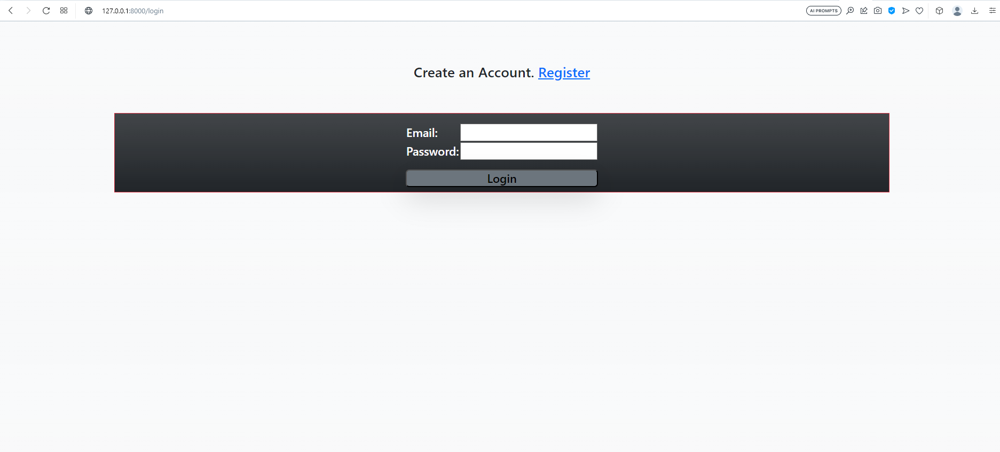
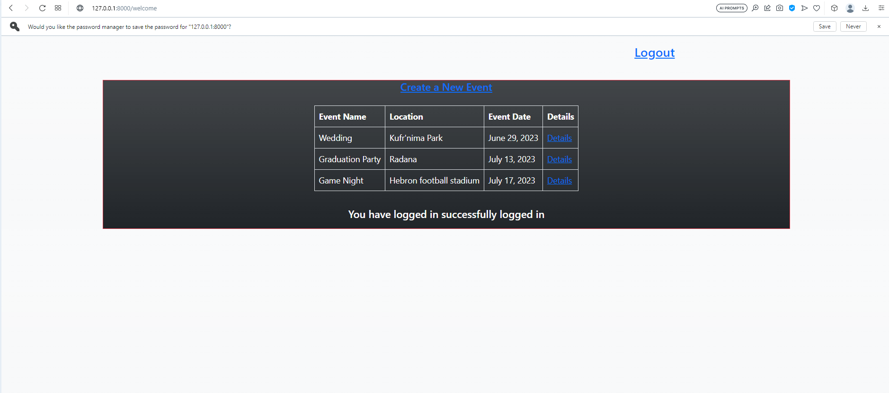
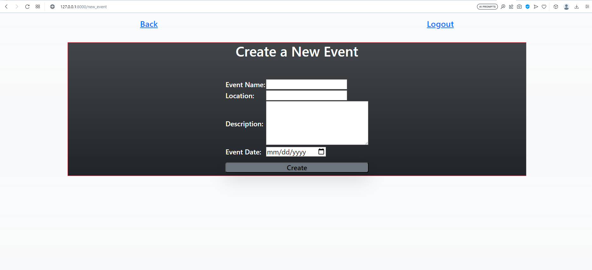
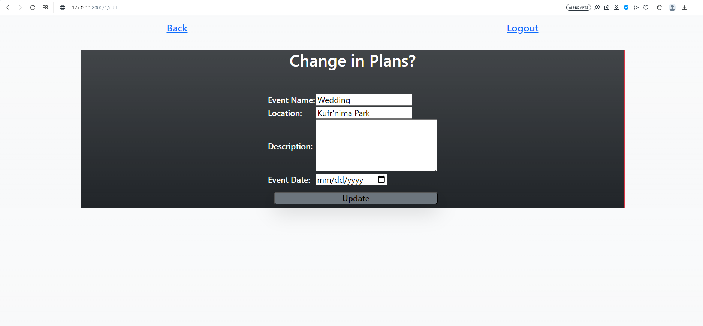
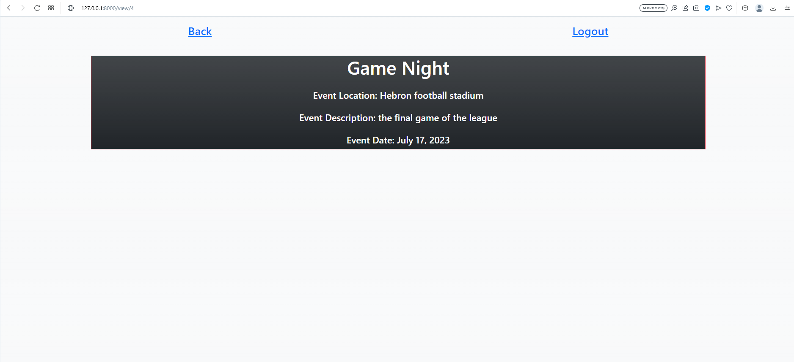

# Event-Planner
---

With the increased number of events being held in the countries there is an increased need for a way to plan the events
  in a more organised way that gives the ability for all the users to check the dates of other events in order to not cause
  any conflicts in schedule. This website does provide this need.

 
## Functionality and Features
---
<ul>
  <li>This website will have a registeration page for the first visit and will have a seperate link for the users that already have an account to log in to with validation on both pages.</li>
  
    
  
  <li>After the regestration or logging in the user will be directed to a page that has a list of all the booked events, a link to add a new event and a way to view the details of the booked events.</li>
  
  <li>Clicking the link to create a new page will take the user to a form that allows the user to book his event,
    there will be validation for the data inputted which returns error messages and if the location and date are already booked there will be an error message shown.</li>
  
  <li>Deciding to check the details of the events will lead to 1 of 2 pages depending on the fact if the user is the creator of the event or not.</li>
  <li>If the user is the creator of the event then the user will access a page that has links to edit or delete the event.</li>
  
  <li>The user can either delete the event or edit the event using the link provided.</li>
  <li>The edit page will lead to  form that has the previous information that the user wants to edit.</li>
  
  <li>If the user is not the creator the page shown will only have the details of the event.</li>
  
</ul>
 
Technologies used
---
<ul>
  <li>Python</li>
  <li>HTML</li>
  <li>CSS</li>
  <li>Bootstrap</li>
</ul>
